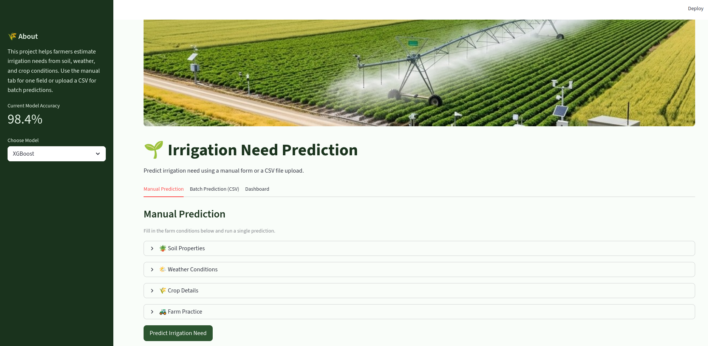
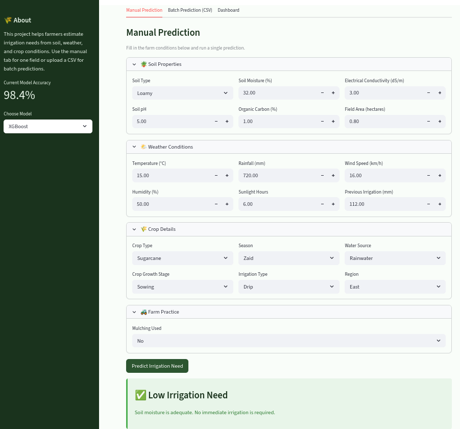
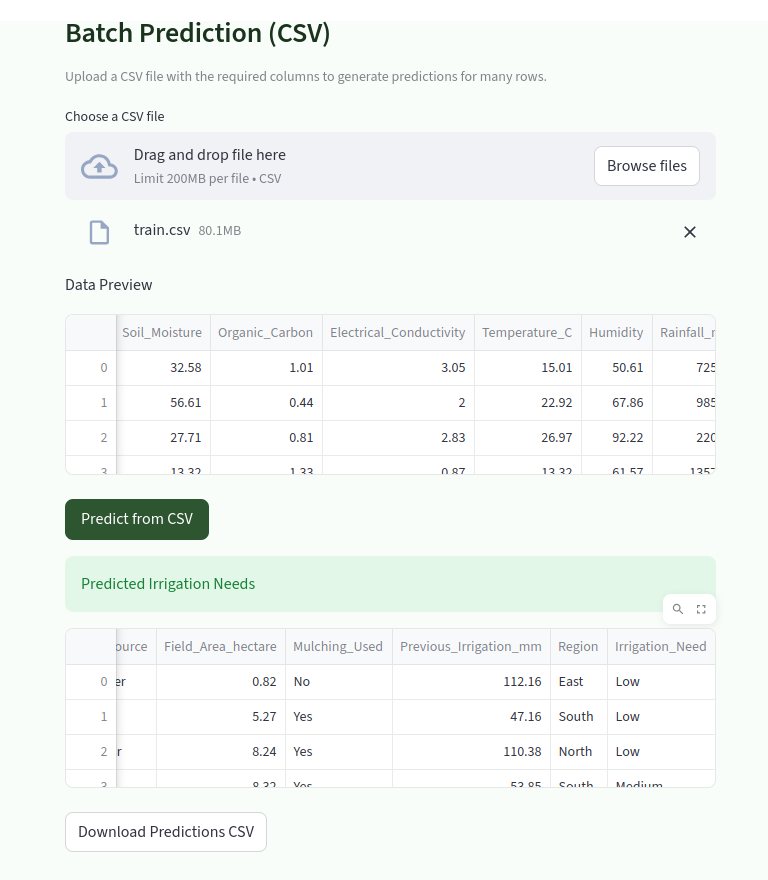
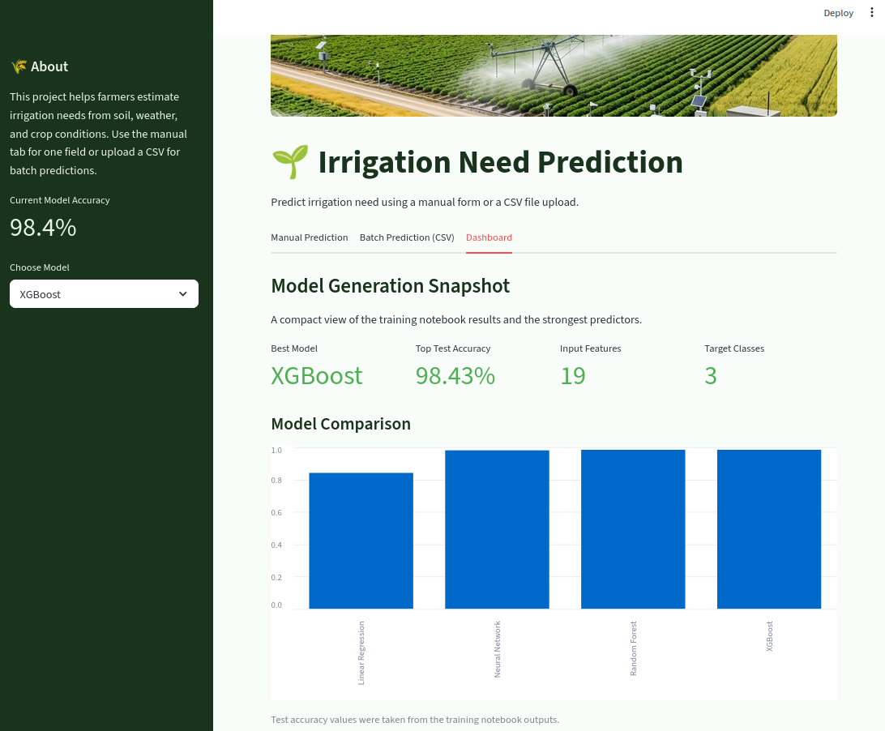
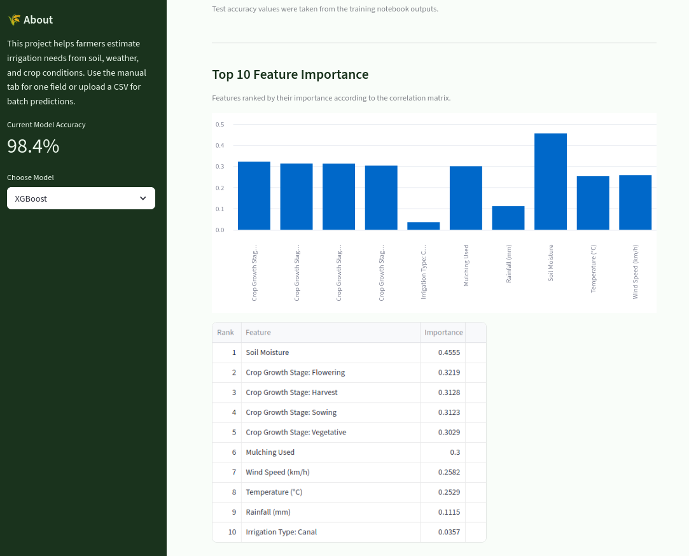

# 🌱 Irrigation Need Prediction

A machine learning web application built with Streamlit that helps farmers estimate irrigation needs based on soil properties, weather conditions, and crop details.

## Features

*   **Manual Prediction:** Enter farm conditions directly into the app to get a single prediction.
*   **Batch Prediction (CSV):** Upload a CSV file containing multiple fields/records to generate predictions in bulk and download the results.
*   **Model Options:** Choose between XGBoost (recommended), Neural Network, and Linear Regression models.
*   **Dashboard Snapshot:** View quick statistics about model performance and feature importance.

## How to Run the App

1.  **Install Requirements:** Make sure you have Python installed. You will need `streamlit`, `pandas`, `scikit-learn`, and `xgboost`.
    ```bash
    pip install streamlit pandas scikit-learn xgboost
    ```
2.  **Start the App:** Run the following command in your terminal from the project directory:
    ```bash
    streamlit run app.py
    ```
3.  **Use the App:** The app will open in your default web browser. You can navigate through the "Manual Prediction", "Batch Prediction (CSV)", and "Dashboard" tabs.

## User Guide

### 1. Manual Prediction: Entering Field Data
To get started, you can input the specific conditions of a single field. Expand the sections for Soil Properties, Weather Conditions, Crop Details, and Farm Practice to accurately describe the environment.



### 2. Getting Actionable Insights
Once the data is entered, click **Predict Irrigation Need**. The application will use the selected machine learning model to provide an immediate, color-coded alert indicating whether the irrigation need is Low, Medium, or High, along with actionable advice.



### 3. Scaling Up: Batch Predictions
If you manage multiple fields, you can save time by navigating to the **Batch Prediction (CSV)** tab. Simply upload a CSV file containing the data for all your fields. The app will process the entire dataset at once and allow you to download the combined results.



### 4. Exploring the Dashboard
Curious about how the models were trained? The **Dashboard** tab provides a quick snapshot of the training process, including the best performing model and a comparison of test accuracies across different algorithms.



### 5. Understanding Feature Importance
Also within the dashboard, you can view the Feature Importance chart. This helps you understand exactly which factors (like Soil Moisture or Crop Growth Stage) have the biggest impact on the model's predictions.




## Model Training & Data Pipeline (`Train.ipynb`)

The core machine learning logic, data engineering, and experimentation steps are fully documented in the `Train.ipynb` notebook. If you want to retrain the models, tweak hyperparameters, or explore the underlying "physics" of the dataset, you should start here.

### Inside the Notebook:
*   **Phase 1: Exploratory Data Analysis (EDA):** Includes correlation studies to identify strong relationships between environmental features and distribution analysis to assess the balance of the target classes.
*   **Phase 2: Data Preprocessing & Feature Engineering:** Demonstrates how structural data needs were addressed, including handling feature redundancy (multicollinearity) and applying appropriate scaling and encoding techniques for categorical variables.
*   **Phase 3: Model Development:** A comprehensive comparison of classification architectures. The notebook implements and evaluates multiple models, ranging from a simple Logistic Regression baseline to Tree-based models (Random Forest) and Gradient Boosting algorithms (XGBoost).
*   **Phase 4: Evaluation Strategy:** Models are evaluated using **Balanced Accuracy** to ensure fair assessment across all target classes. The notebook also generates Confusion Matrices and extracts Feature Importance to interpret the most critical factors influencing irrigation levels.

### How to reproduce the training:
1.  **Download the Dataset:** You **must** download the dataset from the [Kaggle Playground Series - S6E4](https://www.kaggle.com/competitions/playground-series-s6e4/overview).
2.  **Setup:** Place the downloaded data files into the directory expected by the notebook.
3.  **Execute:** Run the cells sequentially to clean the data, train the models, and export the best-performing model (using `joblib` or `pickle`) for use in the Streamlit app.
